# Lab 03: Creating Sequential Patterns with Digital Circuit Design

## What We Did In The Last Lab

In the last lab - **Intro to Digital Design**, we delved into the intricacies of digital circuits, starting with the creation of a 2 to 1 mux using fundamental logic gates like AND, OR, and NOT gates. Progressing further, we utilized a 74150 mux chip to construct a more sophisticated 4 to 1 mux, ensuring meticulous wiring based on comprehensive diagrams and documentation. Integrating Arduino, we then employed it to control and test the mux's functionality, programming it to manage input data and control lines while validating output accuracy through systematic testing. Lastly, we designed and implemented a 1-bit adder circuit, demonstrating our proficiency in combining logic gates for arithmetic operations. For more in-depth lab details, refer to the previous lab in this [URL](https://github.com/mlcourses/lab-2-blog-post-group5_cs281/blob/main/post.md)

## Overview and Motivation

In this lab, we'll delve into constructing a circuit that displays numbers on a 7-segment LED based on a knob's position, much like a volume control. The lab starts with some groundwork, where we simplify circuit designs and understand how to represent numbers using a special kind of light display. The main part of the lab involves building a "ramp circuit," which means that as we turn the knob, the numbers displayed on the LED will gradually increase or decrease. We use a device called an Arduino to help with this, which turns the knob's movement into a digital signal. Then, we'll figure out how to use this digital signal to light up the correct LEDs on the 7-segment display. It's a mix of figuring out how to talk to the Arduino, designing the logic for the LED display, and putting it all together on a breadboard. The challenge is to make sure that as we turn the knob, the right numbers light up on the display.

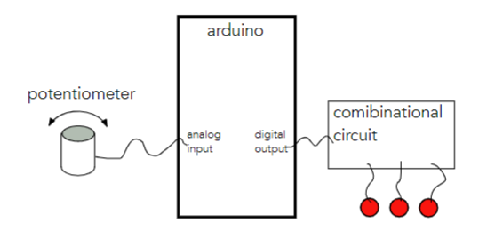

## Lab Objectives

1. Understand the function and operation of a 7-segment display for digital number representation.

2. Construct truth tables to indicate the outputs for each LED segment ion the 7-segment display. 

3. Use Karnaugh Maps to design and optimize the circuit's logics.

4. Use logisim to design and test a boolean circuit that combines the minimized functions for each LED segment.

5. Construct and test a voltage divider circuit using a potentiometer to generate analog input signals.

6. Implement combinational logic circuits to light up the 7-segment display.

7. Use Arduino to interpret digital signals and power the circuit. 

## Materials

- PB-503 breadboard prototyping station

- 7-segment display

- Arduino microcontroller

- 7404 NOT gate IC

- 7408 AND gate IC

- Two 7432 OR gate ICs

- IC data sheets

- Wires and connection tools

- Logic Probes

- Arduino IDE software

- USB cable

- Laptop or device for programming and powering the Arduino

## Project Steps

### Understanding The 7-Segment Display

- A 7-segment display is an electronic component used in devices like digital clocks and calculators.

- It consists of seven individually illuminated segments arranged in a specific pattern.

- These segments can be independently turned on or off to display numbers from 0 to 9 and sometimes additional characters.

- When activated in combination, these segments create the desired numeral or character.

- The display is controlled by electronic circuits that determine which segments should be illuminated to represent the desired digit or character.

- Below is an example of a 7-segment display. 
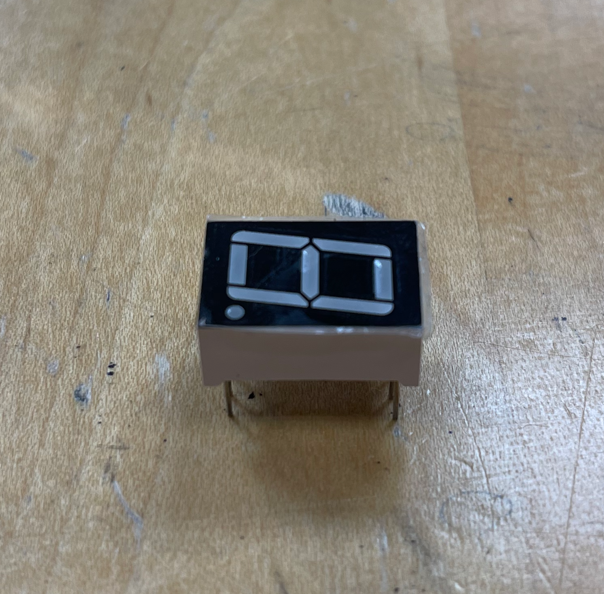

### Designing The Combinational Circuit

- We are going to design the logic of the combinational circuit. The digital signal will be a decimal value between 0 and 5 inclusive. Depending on the value, we will light up the LEDs accordingly. 

- Lets consider **B2**, **B1**, **B0** to be three binary inputs (with **B0** being the least significant bit of the 3-bit digital input that comes from the Arduino). 

- Since we are not using the values 6 and 7, so we can put **x** - "don't care" into the places in the truth table that represents the output of the decimal values 6 an 7 for each LED segment
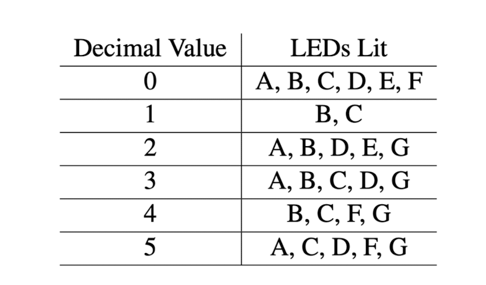

#### 1. Constructing Truth Table

- From the LED Functionality table above, we can construct a truth table as below:
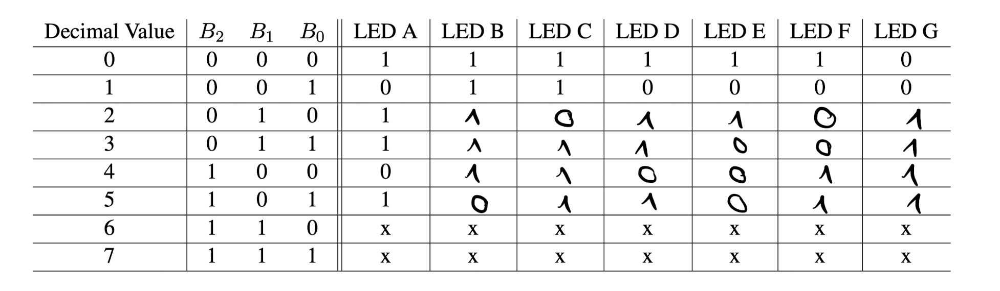

#### 2. Simplifying the Boolean expressions using Karnaugh Maps

- From last lab, we were introduced to the concept of SOP design (Sum Of Products) to derive boolean expressions from truth tables. However, the biggest drawback here is that it is not always possible to simplify those constructed boolean expressions down to 2 or less terms, making our circuit unnecessarily complex (See example for LED A below). That is when another method called Karnaugh Maps come into play. 
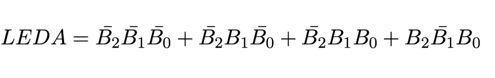

- For techniques regarding the K Maps technique, you can refer to this [link](https://www.geeksforgeeks.org/introduction-of-k-map-karnaugh-map/)

- We can construct the K Maps for each LED segment like be low:


1. **LED A**:
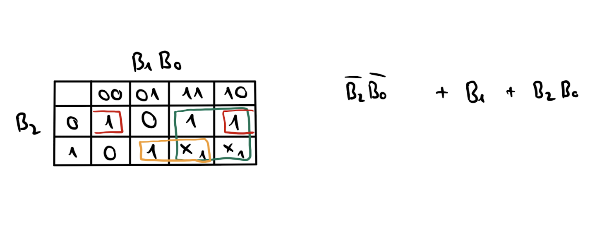

2. **LED B**: 
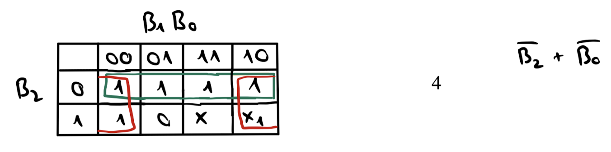

3. **LED C**: 
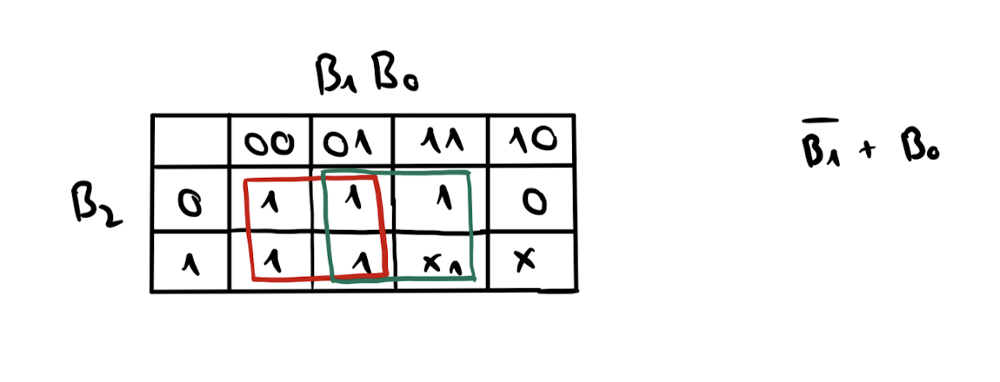

4. **LED D**: 
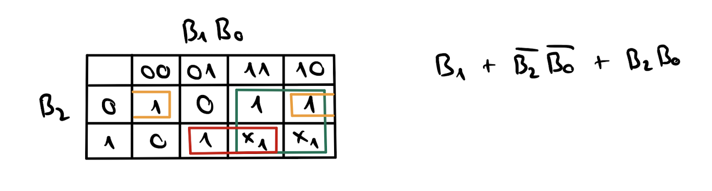

5. **LED E**: 
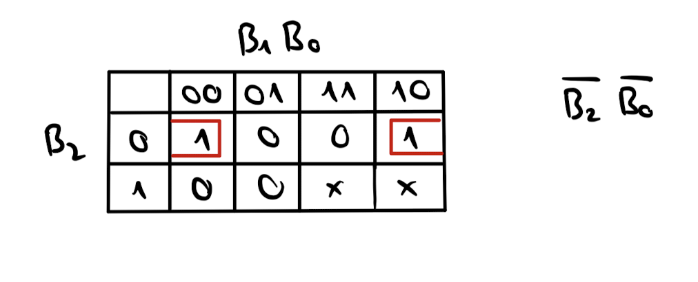

6. **LED F**: 
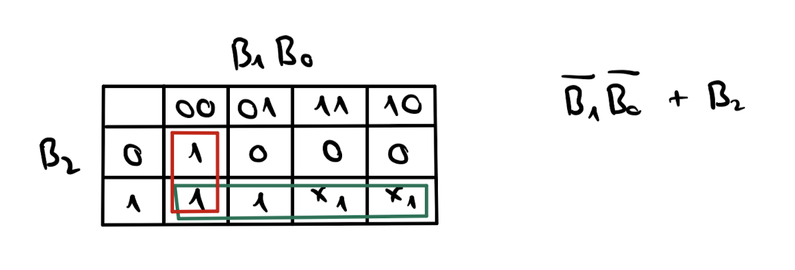

7. **LED G**: 
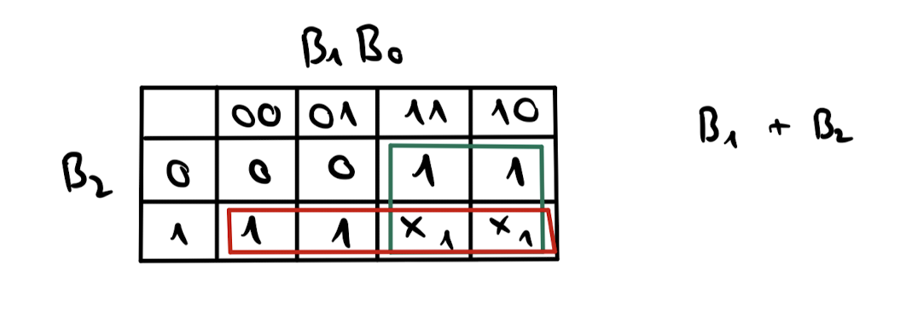

#### 3. Testing the Logic with **Logisim**


### The Voltage Divider

#### 1. Understanding the Voltage Divider

- A voltage divider is a fundamental circuit used to generate a specific voltage level from a power supply. Imagine it as a way to adjust the volume of electricity, similar to adjusting the volume knob on a speaker.
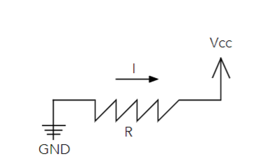

- Consider the circuit above. Here we have a single resistor in a circuit that is wired between Vcc and GND. The equation that governs the operation of this circuit is **V = IR** with **V** being the voltage, **I** as the current and **R** is the resistance value of the resistor. 
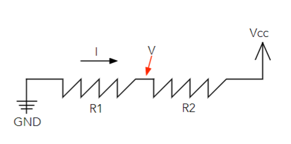

- Now lets look at an example of a voltage divider above. We are having two resistors lining up in one path. The total resistance **R = R1 + R2** would be used to compute the current **I**. 

- Given an electricity current of +5 Volts that flows through the circuit, some voltage is lost at **R1** and the rest is lost at **R2**. The ratio of these resistance values determines the amount of voltage at location **V** as a a fraction of the voltage **Vcc**, which can be calculated like below: 
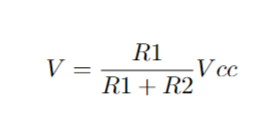

- By choosing our two resistance values, we can pick any voltage **V** that we desire (between 0 and 5 Volts).

#### 2. Understanding the Potentiometer

- Potentiometer, commonly referred to as "pot," serves as a variable resistor pivotal in voltage divider circuits that allow us to fine tune our voltage divider. 
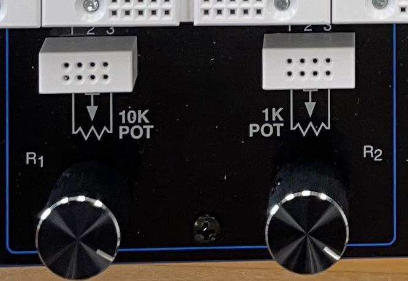

- Our breadboards have two potentiometers: a 10kΩ pot, situated as a knob at the board's bottom, and a 1kΩ variant on the right. The combined resistance for the 10kΩ pot is fixed at 10kΩ, allowing manipulation of R1 and R2 to achieve desired voltage levels. Similarly, the 1kΩ pot operates comparably but maintains a total resistance of 1kΩ.

- We can change the knob to achieve various values for **R1** and **R2** between 0 and 10kΩ so long as their sum is 10kΩ. The 1k potentiometer acts in the same way except for its total resistance being 1kΩ.

#### 3. Wiring the Potentiometer
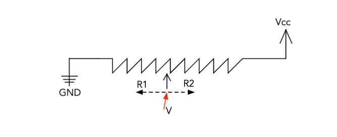

- Above is how we can wire up the potentiometer. The leftmost connection column of the pot will be wired to GND while the rightmost column of the pot will be wired to a +5V. 

- The middle connections are all the same as they will pick off the voltage **V** that depends on the position of the potentiometer knob. We will use one of these moddle connections as the output voltage **V** that acts as the analog input of the Arduino, which will then be converted to data outputs that power up the combinational circuit. 

- Here's how the wiring looks like: 


#### 4. Reading and Converting the Potentiometer Output

- We can start by hooking up the potentiometer to the Arduino by connecting one of the middle connections to the analog input **A0** pin on the Arduino, as well as connecting its GND pin to a GND source from the breadboard.

- After establishing connection with the Arduino via the USB-A cable, we can navigate to the Arduino IDE on our laptop, create a new sketch for this lab and type in the following code: 

```C++
const int potpin = 0;
const int WAIT = 1000; // 1 second delay
void setup () {
Serial.begin(9600);
pinMode(11,OUTPUT);
pinMode(12,OUTPUT);
pinMode(13,OUTPUT);
pinMode(potpin,INPUT);
}
void loop () {
int val;
int dval;
int bitval;
val = analogRead(potpin);
dval = val/171; // normalizing factor-->adjust this to get the range you want
Serial.print("From Pot: ");
Serial.println(val);
Serial.print("Decimal Value Conversion: ");
Serial.println(dval);
//use bit ops to get each bit!
bitval = dval & 1;
digitalWrite(11,bitval); // signal C
dval = dval >> 1;
bitval = dval & 1;
digitalWrite(12,bitval); // signal B
dval = dval >> 1;
bitval = dval & 1;
digitalWrite(13,bitval); // signal A
delay(WAIT);
}
```

- Lets dive into what the code does! 

- The `potpin` variable represents the analog input pin that receives the output going from the middle connection of the potentiometer. It's set to 0, which is the `A0` pin on the Arduino.

- Looking at the `setup()` function, the `Serial.begin(9600)` line Initializes serial communication with a baud rate of 9600, and the `pinMode()` function configures the pins used for the digital outputs (pins 11, 12, and 13) and analog inputs (potpin).

- Looking at the `loop()` function, the function `analogRead()` reads the analog input voltage from the potentiometer and stores it in variable `val`.

- `dval = val / 171`: Converts the analog reading to a decimal value (`dval`) using a normalization factor. If we got values outside the 0 to 5 range, you can subtract `val` with a certain value to get the right `dval` values we want. 

- **Serial Print Statements**: Outputs the potentiometer reading (val) and its corresponding decimal value (dval) to the serial monitor.

- Using bit manipulation methods, the decimal value (`dval`) is converted into binary representation by extracting each bit sequentially.

- `dval & 1` extracts the least significant bit of the 3-bit signal input, which is then written to pin 11 (`digitalWrite(11, bitval)`), representing signal C.
After each LSB extraction, dval is shifted right by 1 bit (`dval = dval >> 1`) to prepare for the next bit extraction.

- `delay(WAIT)`: Pauses the program execution for 1000 miliseconds before repeating the loop.

- The variable `dval` represents the decimal value converted from the analog input from the potentiometer. The most significant bit of `dval` corresponds to pin 13, the middle bit corresponds to pin 12, and the least significant bit corresponds to pin 11.

- Pin 13 (digital pin 13) represents the most significant bit of dval, so it will be the input **B2** of our combinational circuit.

- Pin 12 (digital pin 12) represents the middle bit of dval, so it will be the input **B1** of our combinational circuit.

- Pin 11 (digital pin 11) represents the least significant bit of dval, so it will be the input **B0** of our combinational circuit.

&rarr; If we relate back to the truth table of all the LED segments of the 7-segment display with three inputs, we can see that the data inputs that come from the Arduino's digital pins (13, 12, 11) corresponds to the truth table's inputs **B2**, **B1**, **B0**. This is because when we consider the 3-bit inputs, **B2** corresponds to the most significant bit of the input, **B0** corresponds to the least significant bit of the input, so the middle bit is **B1**. 


### Putting It All Together

## Testing

## Conclusion


